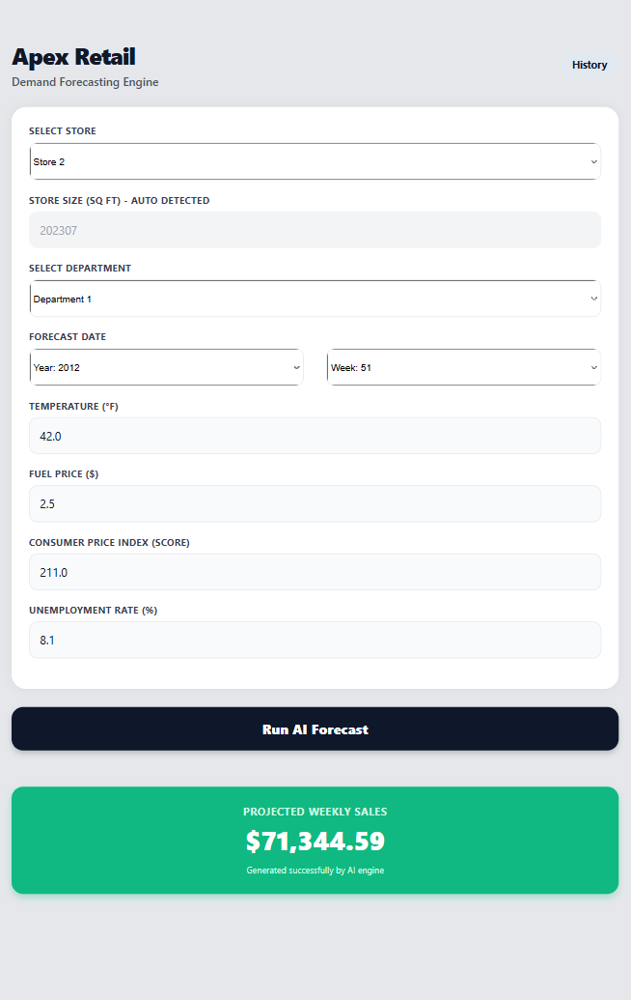
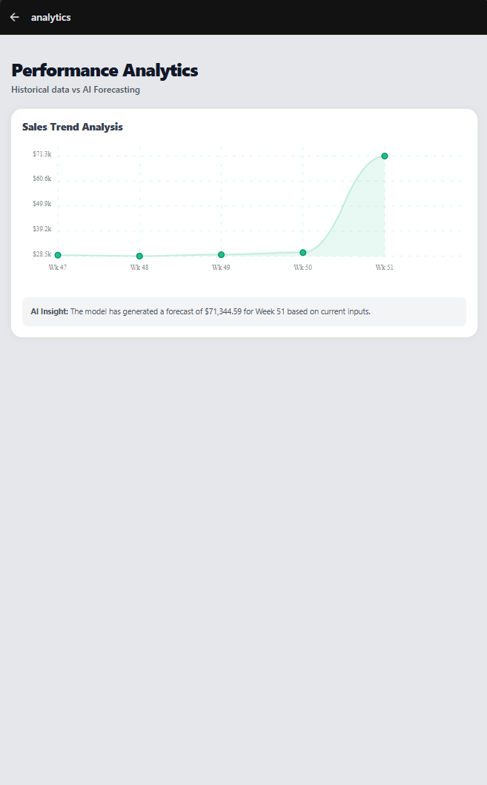

# Apex Retail - Demand Forecasting Engine

An AI-powered, microservice-based mobile application designed to forecast retail department sales based on historical trends and environmental factors (temperature, fuel price, CPI, etc.).

## 📱 Screenshots

<div align="center">
  
  &nbsp;&nbsp;&nbsp;&nbsp;
  
</div>

## 🏗️ Architecture & Tech Stack

This project utilizes a modern microservices architecture divided into three distinct layers:

1. **AI Microservice (Python / FastAPI):** Hosts a trained Random Forest machine learning model (`.joblib`) using `scikit-learn` to process environmental inputs and return sales predictions.
2. **Backend API (Java / Spring Boot):** Acts as the central orchestrator. It processes mobile requests, maps dynamic store types (A, B, C), and communicates with the Python AI service.
3. **Frontend Mobile App (React Native / Expo):** A cross-platform mobile UI featuring dynamic state routing and historical data visualization using `react-native-chart-kit`.

---

## ⚙️ Prerequisites

To run this project locally, ensure you have the following installed:

- **Node.js** (v18+)
- **Java Development Kit (JDK)** (v17+)
- **Python** (v3.8+)
- **Expo Go** app installed on your physical mobile device.

---

## 🚀 Installation & Setup Guide

Because this project uses a microservice architecture, you must start the services in the following order:

### 1. Start the AI Microservice (Port 8000)

Navigate to the Python folder, install dependencies, and start the FastAPI server.

```bash
cd 2_ai_microservice
pip install -r requirements.txt
uvicorn main:app --reload
```

### 2. Start the Backend API (Port 8080)

Navigate to the Java folder and run the Spring Boot application.
Note: Ensure the Python server is running first so Java can communicate with it.

```bash
cd 3_backend_java
# Run via your IDE (IntelliJ/Eclipse) or using Maven/Gradle wrapper:
./mvnw spring-boot:run
```

### 3. Start the Mobile App (Expo)

Before starting the app, you must update the IP Address if running on a physical device.

- Find your computer's local IPv4 address (e.g., 192.168.1.X).

- Open 4_frontend_app/app/(tabs)/index.tsx.

- Update the fetch URL in the handlePredict function to match your computer's IP:
  http://YOUR_IP_ADDRESS:8080/api/v1/predictions/forecast

Then, install dependencies and start the bundler:

```bash
cd 4_frontend_app
npm install
npx expo start -c
```

Scan the QR code with the Expo Go app on your phone to launch the application.

## 📊 Features

- **Live AI Forecasting:** Inputs dynamic retail parameters to generate real-time sales predictions.

- **Dynamic Pipeline:** Java backend automatically maps and one-hot encodes Store Types (A, B, C) based on the user's store selection.

- **Historical Analytics:** Visualizes historical retail trends against the newly generated AI prediction using dynamic parameter passing via Expo Router.

## 📄 License

Distributed under the MIT License.

## 👤 Author

- Mihiranga
- GitHub: @mihiranga-dev
